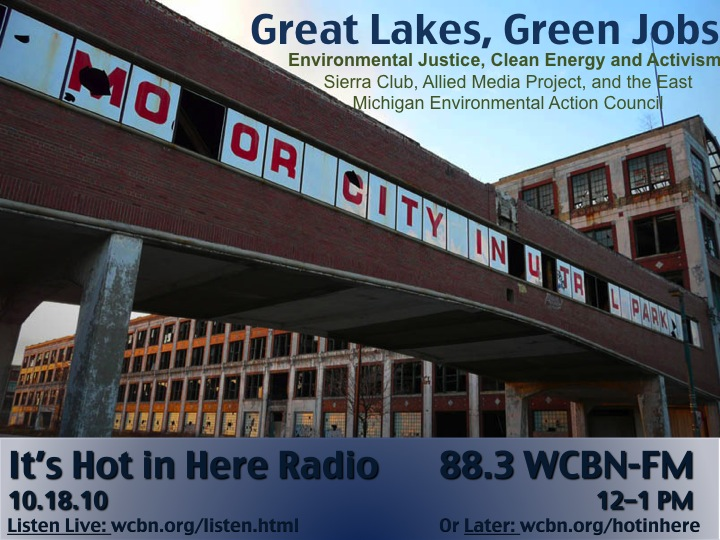

<iframe src="https://archive.org/embed/SNREHotInHere/2010-10-18_GreatLakes_GreenJobs.mp3" width="500" height="30" frameborder="0" webkitallowfullscreen="true" mozallowfullscreen="true" allowfullscreen></iframe>

[Download Here](https://archive.org/download/SNREHotInHere/2010-10-18_GreatLakes_GreenJobs.mp3)

This just in: the Detroit Incinerator is offi­cially shut down and the Beehive Collective is soon coming to town!  
  
Tune into It’s Hot in Here, Monday from 12–1 on 88.3 WCBN-​​FM-​​Ann Arbor, or wcbn​.org/​l​i​s​t​e​n​.​h​tml for our “Great Lakes, Green Jobs: Environmental Justice, Clean Energy, Activism” edition.  
  
Michelle Martinez, SNRE Alum and Cool Cities Project Staff Organizer with the Sierra Club will join us live in the studio to talk clean, green jobs in the Great Lakes Region. Diana Nucera from the Allied Media Project and Ahmina Maxey form the East Michigan Environmental Action Council will joins us on the phone to chat about the Beehive Collective and the recently closed Detroit Incinerator.  
  
Listen closely and you may even score a free pair of tickets to a hot concert near you,  
  
Stay Hot Ann Arbor,  
Gina
