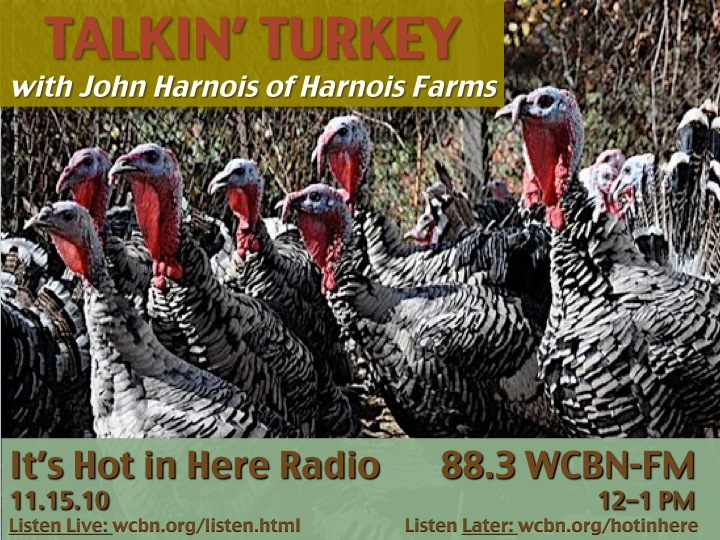

<iframe src="https://archive.org/embed/SNREHotInHere/2010-11-15_TalkingTurkeys.mp3" width="500" height="30" frameborder="0" webkitallowfullscreen="true" mozallowfullscreen="true" allowfullscreen></iframe>

[Download Here](https://archive.org/download/SNREHotInHere/2010-11-15_TalkingTurkeys.mp3)

Listen in and let  [John Harnois of Harnois Farms](http://www.realtimefarms.com/farm/harnois-farms) put you in the mood for the most deli­cious secular holiday of the year — THANKSGIVING! John hand-raises happy, healthy, and sometimes heritage turkeys, chickens, geese, and ducks. Birds so well-lived, you can taste the love!
