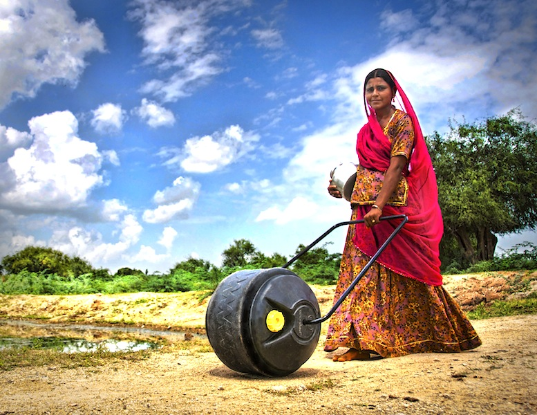

<iframe src="https://archive.org/embed/SNREHotInHere/2010-11-22_Hello_Wello.mp3" width="500" height="30" frameborder="0" webkitallowfullscreen="true" mozallowfullscreen="true" allowfullscreen></iframe>

[Download Here](https://archive.org/download/SNREHotInHere/2010-11-22_Hello_Wello.mp3)

We’re joined in the studio by Cynthia Koenig of [Wello](http://hughstimson.org/hotinhere/wellowater.org), a social venture com­mitted to bringing safe, potable water to the people who need it most.  Guest co-​​host Emily Plews helps us figure out why [grat­i­tude is so healthy](http://mentalhealthnews.org/practicing-gratitude-enhances-well-being/841903/) and why[keeping your mind from wan­dering keeps you happier](http://www.nytimes.com/2010/11/16/science/16tier.html?_r=1&ref=science).  Plus a call-​​in from Gina, mystery tunes from DJ Local, a full season of food politics, and an all-​​around feel-​​good time — take a listen, why don’t you?  
  
More resources about water from Cynthia:  
  
[sarvajal​.com](http://hughstimson.org/hotinhere/sarvajal.com) — a quickly-​​scaling water outlet serving India  
  
[water​.org](http://hughstimson.org/hotinhere/water.org) — for back­ground info on the growing world water crisis  
  
Follow Wello on Twitter: @wellowater
