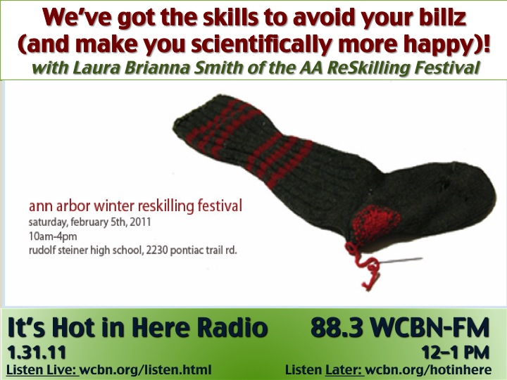

<iframe src="https://archive.org/embed/SNREHotInHere/2011-01-31_ReskillingFest.mp3" width="500" height="30" frameborder="0" webkitallowfullscreen="true" mozallowfullscreen="true" allowfullscreen></iframe>

[Download Here](https://archive.org/download/SNREHotInHere/2011-01-31_ReskillingFest.mp3)

Want to feel more sat­is­fied in your day-​​to-​​day?  Always been curious about home funerals/​permaculture/​meditation/​bread-​​yogurt-​​kombucha-​​making/​wild winter medicines/​getting your garden going, et al?  
  
Then listen in as we talk skillz, sat­is­fac­tion and com­mu­nity with a few good folks from the [Ann Arbor Winter 2011 Reskilling Festival](http://a2reskill.blogspot.com/). The eloquent and ever-​​lively Laura Smith of AA Reskill/​Transition Ann Arbor/​UM joins us live from the [WCBN studios](http://www.wcbn.org/listen.html).  And as if by magic, Jeanne Mackey, founding member of [Transition Ann Arbor](http://www.transitionannarbor.org/pages/?q=node/3), and Merilynne Rush of [After Death Home Care](http://www.afterdeathhomecare.com/) join us by phone.  
  
Ready to discover your Reskills? (We sure are!) Mark your cal­en­dars for this Saturday, February 5th. Consult the [Reskilling Festival Schedule.](http://www.transitionannarbor.org/pages/sites/default/files/Winter2011ReSkillingSchedule_new.pdf) And head on down to the Rudolf Steiner High School, 2230 Pontiac Trail, Ann Arbor, MI, this Saturday, February 5th, ANYTIME from 10–4. 
  
Can’t make it? Not to worry! Visit the [AA Reskill blog](http://a2reskill.blogspot.com/) for details on upcoming Wednesday Reskilling Workshops!
