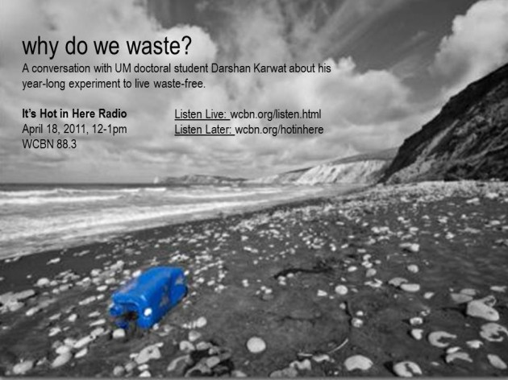

We chatted with UM doctoral student about his year-​​long exper­i­ment to go trash-​​free. See audio link to show below, and learn about how he managed this exper­i­ment, blogged about it, and inspired others in the process! Check out [Darshan’s blog](http://minimizingentropy.blogspot.com/) for his reflec­tions on trash in society.
