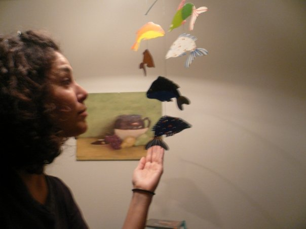

<iframe src="https://archive.org/embed/SNREHotInHere/2011-05-16_SierraClub.mp3" width="500" height="30" frameborder="0" webkitallowfullscreen="true" mozallowfullscreen="true" allowfullscreen></iframe>

[Download Here](https://archive.org/download/SNREHotInHere/2011-05-16_SierraClub.mp3)

The [Sierra Club](http://michigan.sierraclub.org/)’s not just about birds anymore.  
  
Join us, as we talk fish, hair, toxics, green jobs, energy, envi­ron­mental justice and more with [Michelle Martinez,](http://connect.sierraclub.org/Michelle76) former UM School of Natural Resources and Environment M.S. student and current orga­nizer with the Sierra Club.
