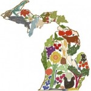

<iframe src="https://archive.org/embed/SNREHotInHere/2011-09-05_HomegrownFest.mp3" width="500" height="30" frameborder="0" webkitallowfullscreen="true" mozallowfullscreen="true" allowfullscreen></iframe>

[Download Here](https://archive.org/download/SNREHotInHere/2011-09-05_HomegrownFest.mp3)

The right­eous Laura Miesler joined us in the studio to chat about the upcoming, also right­eous, Homegrown Festival(!) Listen to that con­ver­sa­tion here…along with some great tunes by bands that will be at the festival. How can you listen and not get pumped about this event? Additionally in this episode: learn what to do when vehicles vacate city streets, and why Brazil nuts are so dang good for you.
