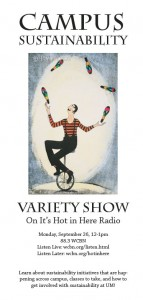

<iframe src="https://archive.org/embed/SNREHotInHere/2011-09-26_UMVarietyShow.mp3" width="500" height="30" frameborder="0" webkitallowfullscreen="true" mozallowfullscreen="true" allowfullscreen></iframe>

[Download Here](https://archive.org/download/SNREHotInHere/2011-09-26_UMVarietyShow.mp3)

Sick of envi­ron­mental talk being so gloomy-​​n-​​doomy? Wish you knew more about what sustainability-​​related ini­tia­tives and events were hap­pening on U-M’s campus? Been han­kering for some great tunes about Mother Earth? Welp, then WCBN 88.3FM has the answer for you!  
  
Co-​​hosts Kat Superfisky and Laura “Smitty” Smith bring you the “U’M Sustainability Variety Hour”!  
  
Not all envi­ron­mental talk needs to be depressing! listen in on this infor­ma­tive and inspi­ra­tional segment about sus­tain­ability hap­pening right here on U-M’s campus…from the top down AND bottom up!  
  
Special guests include: Student Sustainability Initiative, Environmental Issues Commission, Graham Scholars, TEDxArb folks, and real students taking real sus­tain­ability courses!
