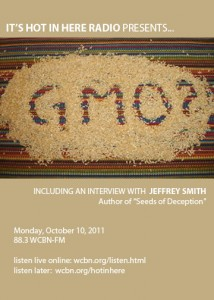

<iframe src="https://archive.org/embed/SNREHotInHere/2011-10-10_TalkingGMOs.mp3%20width=" height="30" frameborder="0" webkitallowfullscreen="true" mozallowfullscreen="true" allowfullscreen></iframe>

[Download Here](https://archive.org/download/SNREHotInHere/2011-10-10_TalkingGMOs.mp3)

Wondering about all this hype and con­tro­versy around GMO’s? “It’s Hot in Here Radio” presents an hour of GMO talk, punc­tu­ated with some catchy tunes, including, yes, a rap song about GMO’s.  
  
Millions of people speak out against the spread of Monsanto’s biotech food, but what is the science actually saying about the safety of Genetically Modified Organisms? Local activists Karen and Francis preview “World Food Day” coming up this weekend, October 15th, 5-​​9pm at the Ann Arbor Farmer’s Market — where the talk and activism will be centered around edu­ca­tion about the harmful effects of GMO’s. Also in this radio hour, hear exceprts from a pre-​​recorded inter­view with Jeffrey Smith, a best­selling author who is leading the charge to warn the public.
