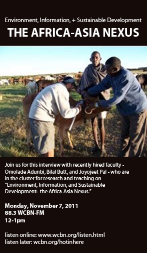

<iframe src="https://archive.org/embed/SNREHotInHere/2011-11-10_AfricaAsiaNexus.mp3" width="500" height="30" frameborder="0" webkitallowfullscreen="true" mozallowfullscreen="true" allowfullscreen></iframe>

[Download Here](https://archive.org/download/SNREHotInHere/2011-11-10_AfricaAsiaNexus.mp3)

_**From oil wars to heroic computer geeks to strap­ping GPS devices on cows…**_  
  
Join us for this inter­view with recently hired faculty in the cluster for research and teaching on “Environment, Information, and Sustainable Development:  the Africa-​​Asia Nexus.”  Joyojeet Pal is assis­tant pro­fessor at the School of Information, Omolade Adunbi is assis­tant prof in the Department of African and African-​​American Studies, and Bilal Butt is in SNRE.  Host Rebecca Hardin will talk with them about the view of these issues from their homes and field sites in India, Kenya, and Nigeria.
