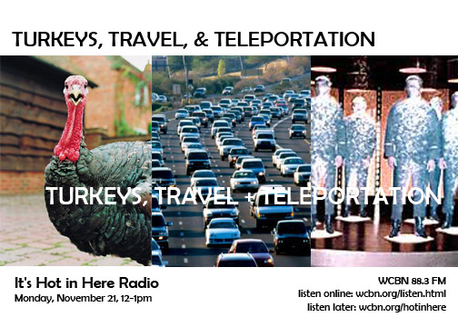

Just in time for the mass exodus from Ann Arbor, SNRE’s own **Shelie Miller**, a specialist in life cycle assessment and energy, shares insights on sustainable transit.  Beyond the typical modes, she entertains our questioning of tele­por­ta­tion as surely the MOST sustainable transit form! ;)  Turkey man and local farmer **John Harois** is also in the studio to tell us about his magnificent birds. We hear all about why Kat’s dad drives from afar for these delectable pavos. A turkey slayer also calls in with the gruesome details. It _is_ hot in here!
