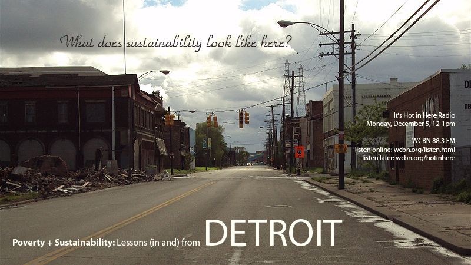

We kick off the show looking at what the most sustainable Christmas tree options are (with one of our hosts even citing some insight she gained from a life cycle assessment she ran!). Then we set our sights on Delray, one of Detroit's most impoverished neighborhoods.  It is a long-​​time victim to city planning efforts, sits in the most polluted zip code in the state of Michigan, and is the future home of the bridge plaza for the proposed International Trade Crossing to Canada – that is all to say, it is a HOT-​​BED for envi­ron­mental injus­tice. Listen in as **Urban Planning** **Professor Larissa Larsen** joins us in the studio to discuss the muddy terrain of urban sus­tain­ability in Delray. We will also have recent UM grad **Chris Detjen** in the studio to share his expe­ri­ences living in Detroit and working on sus­tain­ability issues. The whole radio hour is  punc­tu­ated by some catchy Detroit tunes. Do tune in!
