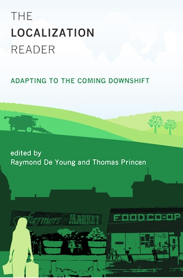

 

<iframe src="https://archive.org/embed/SNREHotInHere/2012-02-20_Localization_Reader.mp3" width="500" height="30" frameborder="0" allowfullscreen="allowfullscreen"></iframe>

[Download Here](https://archive.org/download/SNREHotInHere/2012-02-20_Localization_Reader.mp3)

Join us for this in-​​depth preview of the recently released book: **“The Localization Reader: Adapting to the Coming Downshift.”** Dr. Raymond De Young, co-​​editor of and con­trib­utor to the book, joined us in the studio to chat about the book’s content and process.

**Raymond De Young** is an Associate Professor in the School Natural Resources + Environment. His work in the Environmental Psychology lab centers around ques­tions of moti­vating envi­ron­mental stew­ard­ship, main­taining human well-​​being, and pro­moting positive local­iza­tion in the face of daunting envi­ron­mental challenges.

**_Find the book online [here](http://mitpress.mit.edu/catalog/item/default.asp?t&tid=12829)._**
