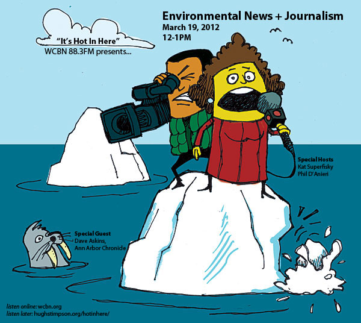

_why is the news so depressing?_ _can we trust the media to accurately report on environmental affairs?_ _what will/​should the future of environmental news + journalism be?_

Join **Kat Superfisky** (SNRE) + special guest co-​​host **Phil D’Anieri** (famous NPR and PitE legend), along with special guest **Dave Askins** (from The Ann Arbor Chronicle) as they yap all about **_“Environmental News + Journalism.”_**
