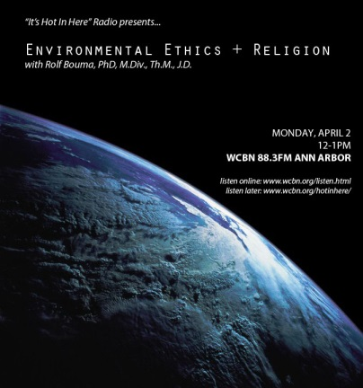

_NOTE: In this episode, we erroneously reported that Bill McKibben left 350.org…this is not true! It was an April Fool’s joke that Laura mistook for truth. Please accept our HUGE apology for a news mistake of this magnitude!_

“It’s Hot in Here Radio” charts new ter­ri­tory for the program… Today we ask: what does scrip­ture tell us about envi­ron­mental stew­ard­ship? What are the messages fueling faith-​​based approaches to envi­ron­men­talism? Dr. Rolf Bouma joins us in the studio to discuss the inter­sec­tion of envi­ron­mental ethics and religion.<!--more--> _**Dr. Rolf Bouma**_ _is the Pastor for_ _**Academic Ministries at the Campus Chapel**_ _and directs the_ _**Center for Faith & Scholarship**__, a Christian study center at the University of Michigan.  He received his Ph.D. from Boston University in the field of Systematic Theology. In addition to thesis work on biotech­nology and a theology of nature, he also has been exten­sively involved in science and religion dialogue.  Rolf teaches envi­ron­mental ethics and envi­ron­mental values/​public policy as part of the University of Michigan’s Program in the Environment. He has taught theology at Calvin College in Grand Rapids, Michigan._

_Rolf also holds M.Div. and Th.M. degrees from Calvin Theological Seminary and has served con­gre­ga­tions in Grand Rapids (Eastern Avenue CRC) and Boston (Hope CRC, Framingham, MA). He also obtained a J.D. degree from the University of Michigan Law School (1982)._
