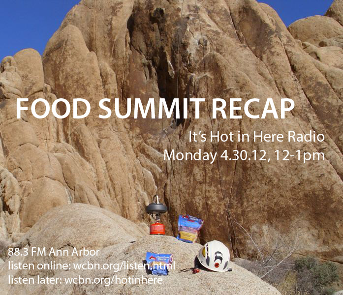

We hosted this con­ver­sa­tion with Shannon Brines, Jason Frenzel, and Lucas DiGia, orga­nizers of the [**April 2012** **Local** **Food Summit**](http://localfoodsummit2012.blogspot.com/). How did the summit go? What were the major themes and outcomes this year? Listen in to find out! (Don’t miss some of Lucas’ awesome [Rap for Food](http://hughstimson.org/hotinhere/www.facebook.com/rapforfood) toward the middle of the show!)

_(+ bonus con­ver­sa­tion with Matt Grocoff, orga­nizer of the [Mission Zero Fest](http://www.missionzerofest.org/) coming up_ _June 9–10, 2012. If you are a green building junkie, be sure to listen to the last 10 minutes of the audio to hear a preview of the fest…)_
