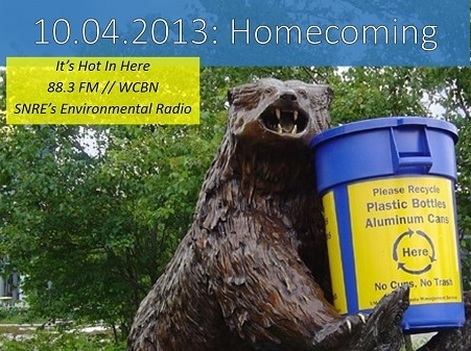

**Oct. 4, 2013:** This week we bring you recycling in the Big House, SNRE's Career Week, and a deforestation campaign gaining traction on campus.

University of Michigan student, **Ian Makowske** (MS Behavior, Education, and Communication 2015), talks about fusing two of his passions—athletics and sustainability—in an exciting new recycling initiative at the Big House football stadium.<!--more-->

SNRE’s Coordinator of Student Services, **Lisa Yee-Yitzenberg,** and masters student **Claire Boland** (MS Sustainable Systems 2014) have been hard at work lining up a week’s worth of environmental career events connecting SNRE alums, environmental professionals, and students. They join us on the show and tell us what’s in store.

**Eva Resnick-Day**, Forest Heroes organizer and Green Corps trainee, talks about an important campaign to curb deforestation inIndonesia by encouraging Kellogg’s to turn to a sustainable source of palm-oil.

Happy listening!
