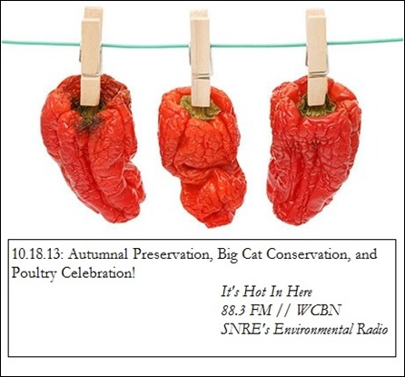

**Oct. 18, 2013:** Listen to learn about food preservation, wildlife conservation in South Africa, and organic poultry farming in Michigan

\- How to **preserve your fruits and veggies** with **Rachel Chadderdon**

\- Pre-vet student, **Andie Haugen's**, experience working with **wildlife in South Africa**

\- **John Harnois**, native Detroiter and local farmer, shares stories of raising **happy hens** and loyal customers

<!--more-->

Autumn is here and the Ann Arbor Farmers Market is overflowing with deliciousness. But [winter is coming](http://www.youtube.com/watch?v=5Y6TqxLmxIo), and with it, the demise of the harvest season. Thanks to **Rachel Chadderdon**, recent UM MS/MPH grad and now with the **[Fair Food Network](http://www.fairfoodnetwork.org/),** there is need to despair! Rachel teaches us 8 useful ways of preserving the bounty of the season so we can enjoy our scrumptious local produce all cold winter long.

**Andie Haugen**, a University of Michigan pre-vet student, talks about her [experience](http://fourgirlsfourcontinents.com/southafrica/ "Blog: Four Girls Four Continents") working with cheetahs and other endangered big cats in South Africa over the summer. Andie is pursuing a self-designed undergraduate major focusing on wildlife management and human-animal interactions, and shares with us fascinating info about tourism-driven lion hunting and the domestication of dogs. Take a peek at some of Andie's incredible summer footage via a [video compilation here](http://www.youtube.com/watch?v=NxqwRU20-zo&feature=youtu.be "Learning to Live With African Wildlife").

**John Harnois,** of [Harnois & Son Farm](http://harnoisfarms.com/), has known for years now that the chicken came before the egg. A Detroit native and art lover, John has been raising happy hens for almost 20 years. He talks to us about the economics of poultry farming, and how he came to produce some of the tastiest eggs and chicken in all the land. Watch out for the John H. Turkey Pot Pie at [Zingerman’s Deli](http://www.zingermans.com/) and find his products at the [Ann Arbor Farmers Market](http://www.a2gov.org/government/communityservices/ParksandRecreation/FarmersMarket/Pages/FarmersMarkethome.aspx), [People’s Food Co-Op](http://www.peoplesfood.coop/), and [Harvest Kitchen](http://www.harvest-kitchen.com/)!

Happy listening! And if you want to learn more about the topics this week, try these useful links:

- [Four Girls Four Continents](http://fourgirlsfourcontinents.com/southafrica/ "Blog: Four Girls Four Continents"): Andie Haugen's Blog
- [Learning to Live With African Wildlife](http://www.youtube.com/watch?v=NxqwRU20-zo&feature=youtu.be "Learning to Live With African Wildlife"): Video compilation of some of Andie's experiences
- [Preserving Food without Freezing or Canning](http://www.goodreads.com/book/show/823761.Preserving_Food_without_Freezing_or_Canning): Book recommended by Rachel Chadderdon.
- [Cheetah Experience](http://www.cheetahexperience.com/)
- [EcoLife Expeditions: Vets in the Wild](http://www.ecolife.co.za/vets.html): University of Pretoria's study abroad program
- [edibleWOW](http://ediblewow.com/): Food magazine featuring John Harnois Oct 2013

Couldn't get enough of Bobby Picket, Benny Goodman, The Talking Heads, and Mike Snow during the show? Listen again: [10/18/2013 Playlist (Grooveshark)](http://grooveshark.com/#!/playlist/IHIH+10+18+13/91582599)
