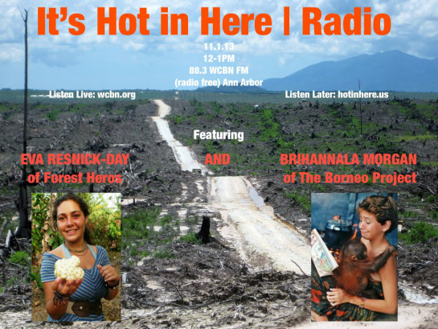

**Nov. 1, 2013:** Two passionate activists join us and talk about their work curbing rainforest deforestation in Southeast Asia.

**\- Eva Resnick-Day,** [Forest Heroes](http://www.forestheroes.org/) campaign organizer and Greencorps trainee, returns to the show to update us on the campaign against the massive palm oil farms that are destroying Indonesia’s rainforest.

**\- Brihannala Morgan,** director of the [Borneo Project](http://borneoproject.org/‎), talks about working with indigenous communities to protect rainforest and land rights. Currently, they’re taking on dam expansion in Malaysian Borneo.
