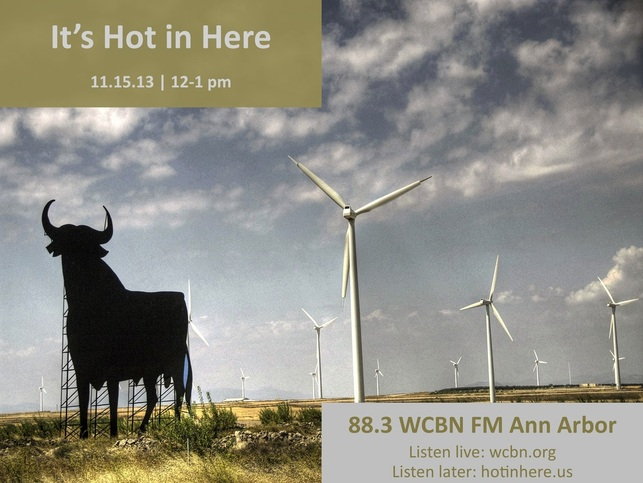

 

**Nov. 15, 2013:** Learn all about the power of storytelling and how it affects the environmental field.

\- **Lianne Lefsrud** (PhD), post-doctoral fellow at the Erb Institute, studies the power of rhetoric and explains to us how storytelling may hold the key to addressing climate change.

\- **Brittany Anstead** (Sustainable Systems, MS ‘15) hails from the Haliwa-Saponi tribe in North Carolina and shares her own story about helping lead her community towards energy independence.

\- What’s in season? Beans, beans, magical beans! **Rachel Chadderdon** (Fair Food Network) talks to us about one of Michigan’s finest exports: delicious dried legumes!

[11.15.13 Playlist (Grooveshark)](http://grooveshark.com/#!/playlist/IHIH+11+15+13/92390783): Femi Kuti, Great Lake Swimmers, Harry Manx, and Kacey Musgraves
