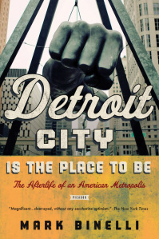
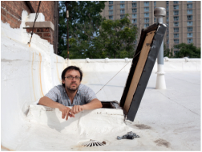

<iframe src="https://archive.org/embed/BinelliNovember62013155220.032" width="500" height="30" frameborder="0" webkitallowfullscreen="true" mozallowfullscreen="true" allowfullscreen></iframe>

On November 6, 2013, Jennifer sat down with Mark Binelli to chat about his latest book: _Detroit City is the Place to Be: The Afterlife of an American Metropolis._  One of _P__ublishers Weekly_'s Top 10 Best Books of 2012. 
  
While we'll soon play the audio on an upcoming show, you're welcome to listen to Mark's articulate, energetic, and at times enthusiastic, take on the history and future of Detroit here first!  (Apologies for the minor interruption around min 11:45, this is college radio afterall!)  
  
And, thank you to our good friends and colleagues in the University of Michigan's Program in the Environment for bringing Mark to campus, and inviting us for this interview!  

* * *

  
Born and raised in the Detroit area (but now living in New York), Mark is a contributing editor at _Rolling Stone_ and _Men’s Journal_, and has previously published a novel entitled: _Sacco and Vanzetti Must Die!_   
  
You can read more on _Detroit City is the Place to Be_ below - or by visiting the book's (and Mark's) page at [MacMillian](http://us.macmillan.com/detroitcityistheplacetobe/MarkBinelli) [Publishers](http://us.macmillan.com/detroitcityistheplacetobe/MarkBinelli).  
  
  

* * *

>   
> Once America’s capitalist dream town, Detroit is our country’s greatest urban failure, having fallen the longest and the farthest—and, finally, into the largest municipal bankruptcy in U.S. history. But the city’s worst crisis yet (and that’s saying something) has managed to do the unthinkable: turn the end of days into a laboratory for the future. Urban planners, land speculators, neopastoral agriculturalists, and utopian environmentalists—all have been drawn to Detroit’s baroquely decaying, nothing-left-to-lose frontier.  
>   
> With an eye for both the darkly absurd and the radically new, Detroit-area native Mark Binelli has chronicled this convergence. Sharp and impassioned, _Detroit City Is the Place to Be_ is alive with the sense of possibility that comes when a city hits rock bottom. Binelli does not shy away from exploring the violence, economic devastation, political corruption, and physical ruin that have ravaged his hometown, but he also offers a glimpse of a long-shot future Detroit that is smaller, less segregated, greener, economically diverse, and better functioning—what could be the boldest reimagining of a postindustrial city in our new century.  
>
