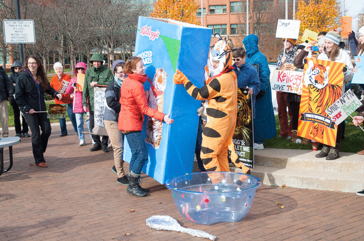

Following recent [announcements from Unilever and Ferraro](http://www.brandchannel.com/home/post/Unilever-Sustainable-Palm-Oil-111513.aspx) stating they would switch to sustainable palm oil sources by 2014, [Forest Heroes](http://www.forestheroes.org/), a Michigan advocacy group for the protection of Indonesian rainforest, decided it was time to apply extra pressure on Kellogg’s to join their pledge.

And thus, last Wednesday [Forest Heroes led a group of over 80 people to Kellogg’s headquarters in Battlecreek](http://www.forestheroes.org/the_cereal_bowl) to deliver over 5,000 petitions and letters from concerned Michiganders, as well as a sign-on letter from over 100 community organizations, businesses, university groups, and faith groups across the state.

Eva Resnick-Day (Forest Heroes organizer, GreenCorps trainee, and two time guest of IHIH)  helped organize and lead the rally, and later sat down with Andrea to talk her through the events, Kellogg’s reaction, the subsequent media storm, and what’s up next.

If you're interested in getting involved in the campaign, or just want to thank Eva for her hard work, please contact her at (_eva at greencorps dot org_).

You can also read more on the story in the [Washington Post](http://www.washingtonpost.com/national/activists-urge-kellogg-co-not-to-use-palm-oil-from-rainforests-where-endangered-tigers-roam/2013/11/20/bca71b96-51c2-11e3-9ee6-2580086d8254_story.html) and [Time](http://newsfeed.time.com/2013/11/20/kelloggs-isnt-being-that-greeeaaat-to-real-tony-the-tigers-and-people-are-angry/), as well as listen to a [previous It's Hot In Here interview with Eva](http://hotinhere.us/1/post/2013/11/11012013.html)!
