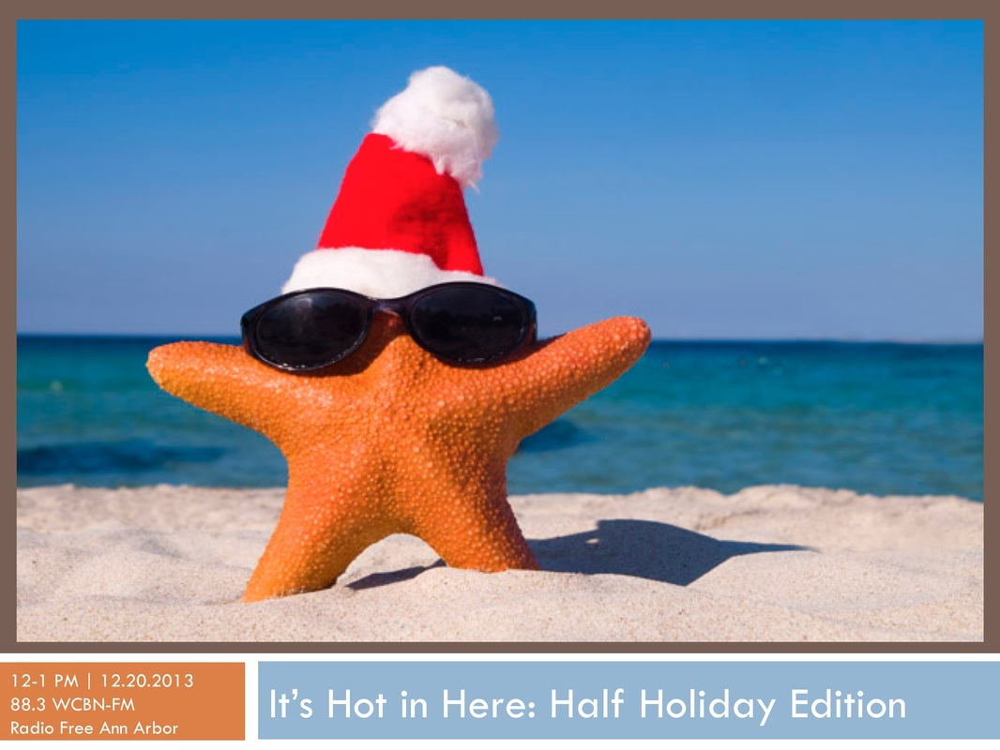

Don't Scrouge yourself this holiday season - tune into _It's Hot in Here_ for a semi-wholesome hour of talk, tunes, and tasty gift ideas.

<!--more-->We'll feature:

- A trip down Detroit's memory lane with Mark Binelli, author of [_Detroit City is the Place to Be: The Afterlife of an American Metropolis._](http://markbinelli.com/about-the-book.html)

- Talk with Jeff Wattrick from Deadline Detroit about his recent article: [Why Did Rand Paul Lie To Me At The Detroit Economic Club?](http://www.deadlinedetroit.com/articles/7521/why_did_rand_paul_lie_to_me_at_the_detroit_economic_club#.UqokRY3RsyZ)
- A special in-studio guest appearance from Rachel Chadderdon Bair, [Director of the](http://www.fairfoodnetwork.org/our-story/leadership/rachel-chadderdon-bair) Fair Food Network's Double Up Food Bucks Program.  Rachel will clue us into What's in Season (at our farmer's markets), and serve up some suggestions for planet- and pocket-friendly holiday gift giving!
