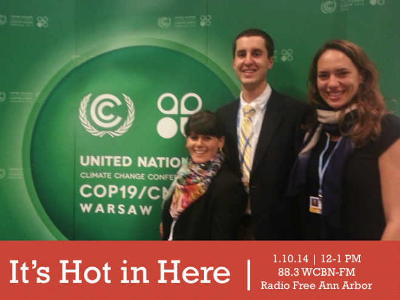

 

In November of 2013, SNRE students Jenny Cooper, Rachel Jacobson, and Chris Wolff joined the throngs of international delegates at the [COP19 UN climate talks](http://www.cop19.gov.pl/) in Warsaw, Poland. In this episode of IHIH, they share some of their most memorable experiences. Listen in and let their stories transport you to the hectic, yet hopeful, scenes in Warsaw's National Stadium, where over 10,000 participants from 89 countries came together to negotiate how to best safeguard present and future generations from climate change.

<!--more-->For more, read their blog post,["COP19: Late Night Reflections on Equity"](http://www.snre.umich.edu/news/11-22-2013/cop19_late_night_reflections_on_equity).

And if you couldn't get enough of Polish dub, polka, and Nina Simone, listen to our playlist again on [Grooveshark](http://grooveshark.com/#!/playlist/IHIH+1+10+14/93997682).
