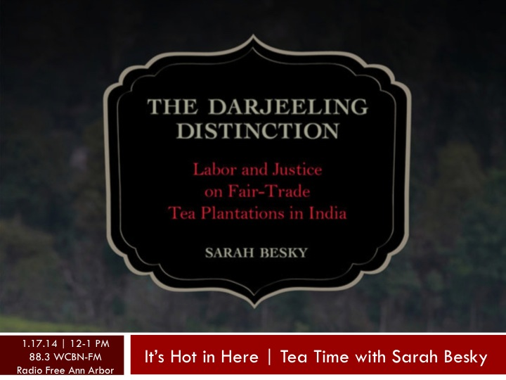

 Ready your cups and saucers and set your kettles to boil! We're talking tea with [Sarah Besky!](http://www.sarahbesky.com/)

Sarah is a Postdoctoral Scholar with the Michigan Society of Fellows and Assistant Professor of Anthropology and Natural Resources and Environment at the University of Michigan. In her book, _The Darjeeling Distinction: Labor and Justice on Fair-trade Tea Plantations in India ([U of California Press, 2013)](http://www.ucpress.edu/book.php?isbn=9780520277397),_ Sarah narrates the lives of tea workers in Darjeeling in engaging and evocative prose to, "explore how notions of fairness, value, and justice shifted with the rise of fair-trade practices and postcolonial separatist politics in the region." _[The Darjeeling Distinction](http://www.amazon.com/The-Darjeeling-Distinction-Fair-Trade-Plantations/dp/0520277392)_ is the first book of its kind, charting a new field for examining how fair-trade operates in the context of large-scale plantation-based production.

Join us (and exxxtra special guest co-host [Rebecca Hardin](http://snre.umich.edu/profile/rdhardin), Associate Professor of Natural Resources and Environment at UM, and [It's Hot in Here Champion Extraordinaire!](http://hotinhere.us/ihih-family.html)!) this Friday from 12-1PM.

Listen live online @ [www.wcbn.org](http://www.wcbn.org), on your phone with WCBN's [iphone](http://www.wcbn.org/content/ios-app-now-available) and [android](https://play.google.com/store/apps/details?id=org.wcbn.player) apps, or the old fashioned (but no less excellent) way by tuning your radio dials to [88.3 WCBN Radio Free Ann Arbor](https://www.facebook.com/wcbn88.3fm).

In the meantime, consider steeping your funny bones in these visual tea puns! (from: http://memebase.cheezburger.com/puns/tag/tea)
