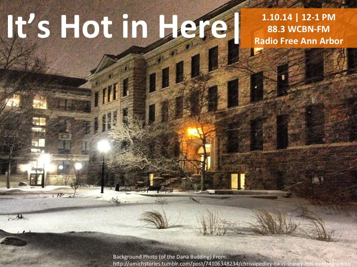

Baby, it's cold outside. In this episode of _IHIH,_ we ask, "What exactly _is_ a polar vortex?", share some rather unusual stories about the grand fight against the winter blues, and check in with the SNRE Food Olympics.

If the show doesn't quite warm you up enough, [keep groovin' to our music playlist](http://grooveshark.com/#!/playlist/IHIH+1+24+14/94621706) (featuring such greats as Barrett Strong, ZZ Top, J Dilla, and Usher), preferably with a hot toddy in hand.

<iframe src="http://www.youtube.com/embed/OCtkn2YFBn8?wmode=opaque" width="300" height="150" frameborder="0" allowfullscreen="allowfullscreen"></iframe>
