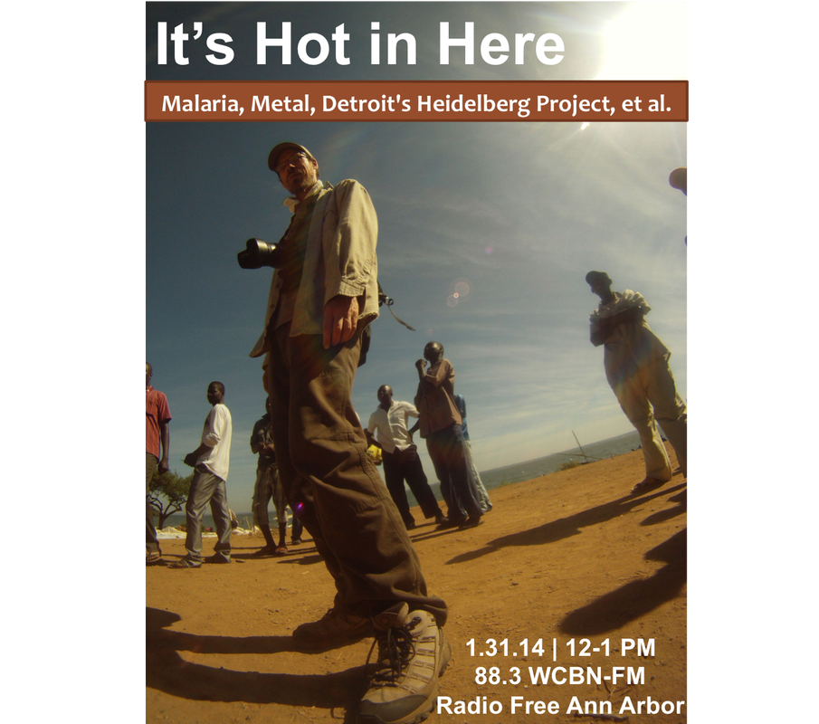

What do malaria, heavy metal, and community art have in common? They're the focal points of this week's _It's Hot In Here!_ We're joined in the studio by [Dr. Peter Larson](http://www.peterslarson.com), post-doctoral scholar in ecology and epidemiology at the University of Michigan, and, awesomely enough, an avid metal fan and musician. Peter shares his love of his work and music with us; introducing us to a [host of metal tunes from various countries in Sub-Saharan Africa](http://www.messynessychic.com/2013/12/27/the-heavy-metal-subculture-of-botswana-africa/) and offering some insight into the spatial distribution and determinants of infectious diseases in Kenya and Malawi.

In the second half of the show, we hear from Katie and Emily of Detroit's [Heidelberg Project](http://www.heidelberg.org/). The Heidelberg Project is an open-air art environment in the heart of an urban community in Detroit's East Side. Tyree Guyton, founder and artistic director, uses everyday, discarded objects to create a two block area full of color, symbolism, and intrigue. Now in its 27th year, the Heidelberg Project is recognized around the world as a demonstration of the power of creativity to transform lives.
