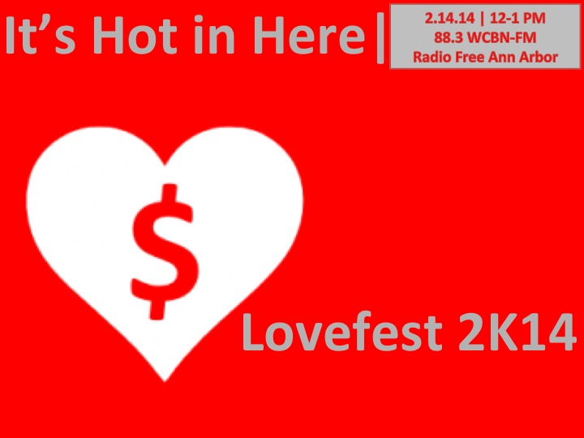

February 14th marks the most celebrated (albeit, corporatized) day for lovebirds everywhere AND one of the final days of [WCBN's Annual FUNdraiser.](http://www.wcbn.org/donate)

In celebration of this delicate confluence - where love and money intertwine and beget more love and money -  we invited friends (and friendly lovers) of It's Hot in Here to join our exxxtra special Lovefest 2K14 Fundraiser edition. We featured the loveliest of tunes and the hottest of our [It's Hot in Here Family](/ihih-family.html) for an exxtra-special hour of heart-warming, purse string-loosening news|views|grooves.<!--more-->

What's more--we were joined by Malian musician [Habib Koite](http://www.habibkoite.com/), one of Africa's most celebrated guitarists. Habib descends from a line of griots, traditional troubadors who provide wit, wisdom and entertainment. His charisma and magnetism translates across cultures in a way few others have achieved. Habib told us a bit about his latest album, [Afriki](http://www.bbc.co.uk/music/reviews/3pgb), and his upcoming performance at The Ark.

We promise, there's no better way to feel the love (and "fight the man") than tuning into 88.3 WCBN-Radio Free-Ann Arbor.  Student-run, community-loved, and listener-supported freeform radio, WCBN is the best in the midwest, if not the world.

Thanks for listening and your continuous support. We hope those of you who had the chance to donate will enjoy having your own [It's Hot in Here gift to love](/events.html), always.

xoxo!

<iframe src="http://www.youtube.com/embed/K4VRGALZdBA?wmode=opaque" width="300" height="150" frameborder="0" allowfullscreen="allowfullscreen"></iframe>
