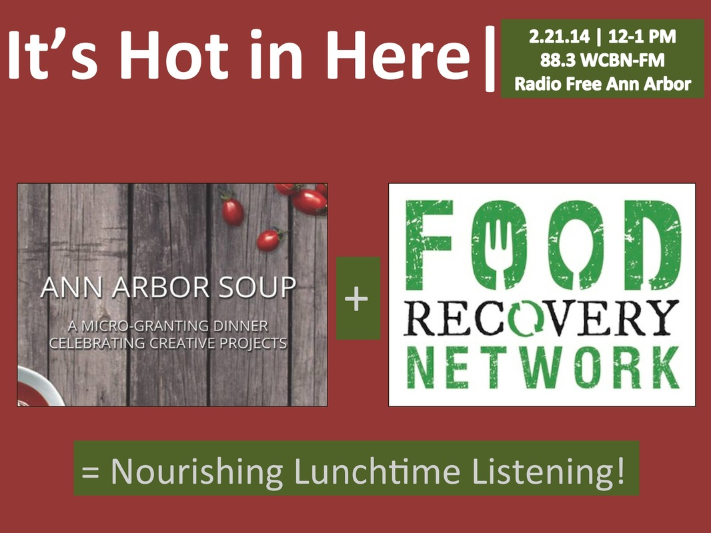

On this show we talk about the community building power of crowd-sourcing, as well as the awesome work that students at the University of Michigan are doing to [fight food waste](http://www.unep.org/wed/quickfacts/).

Miranda Kahn and Izzy Morrison of [Ann Arbor SOUP](http://annarborsoup.weebly.com/) organize micro-granting dinners that bring people from around Ann Arbor together to celebrate and support positive projects in the area. For $5, attendees receive soup, salad, and a vote. The night features presentations by 4 organizations as well as live music. After presenters share their ideas and answer questions, everyone votes on who they believe should win the money gathered from the night. Ann Arbor SOUP was inspired by [Detroit SOUP](http://detroitsoup.com/).

One of the organizations that Ann Arbor SOUP supported in 2013 is the University of Michigan chapter of the [Food Recovery Network](https://www.facebook.com/pages/Food-Recovery-Network-U-of-M/240613049401386), which recovers surplus perishable food from campus dining halls and donates to [Food Gatherers](http://www.foodgatherers.org/). Taylor Flowers and Hannah Gingerich of FRN talk to us about the impact of food waste, FRN's accomplishments, and how they hope to grow in the future.
