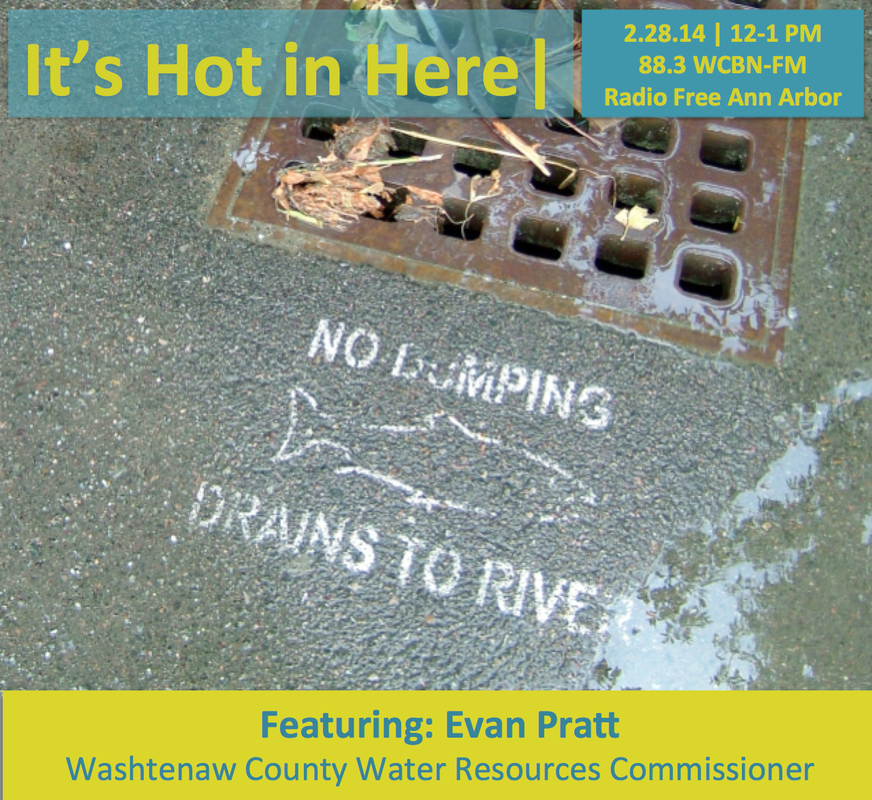

Ever wonder where all this newly melting snow is heading?  Whether it's kosher to dump your paint down the drain? Or, whether there's a toxic plumb of Dioxane 1,4 heading into the mighty Huron River?  Then listen in!

This week Evan Pratt, [Washtenaw County Water Resources Commissioner](http://www.ewashtenaw.org/government/drain_commissioner), graces the WCBN studios with his water-related (and musical!) expertise.

And, we chair dance to Washtenaw's own [Hullabaloo](https://www.facebook.com/pages/Hullabaloo/182583612437)!
