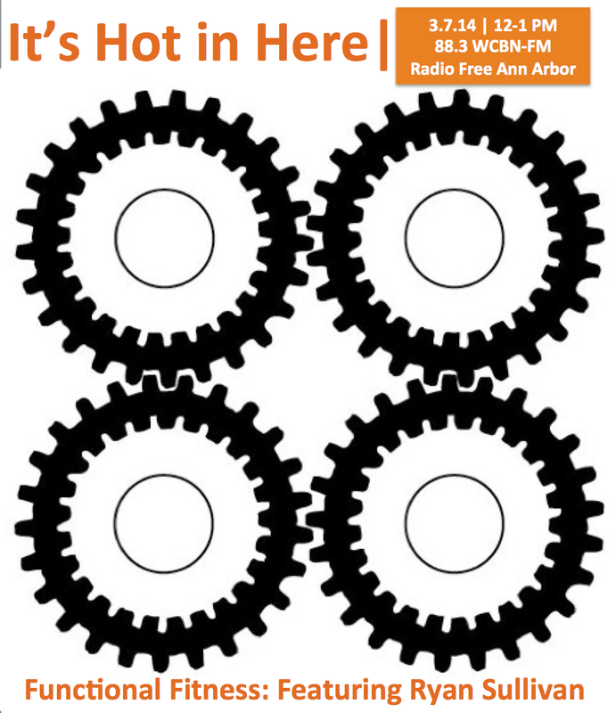

Join us in a lively conversation around function, form, fitness, and food with Ann Arbor's own Ryan Sullivan.  Ryan's an impressively articulate, generous, and observant trainer and owner of the "[boutique-y](https://www.facebook.com/FunctionalfitnessA2)" gym [Functional Fitness](http://functional-fitness.biz/).  He's a self proclaimed "nerd," but we prefer to think of him as a "fitness intellectual" trained in the vernacular arts of movement.

Cookie Woolner (historian and Riot Grrrl) and Mirs Kahn (UM grad and all around awesome gal) sit in as exxxtra special guest co-hosts.

And, we get pumped with tunes from Arnold Schwarzenegger, Roots Manuva, the Descendents, Beastie Boys, Weird Al, and James Brown!

Curious re: Kettlebells? Check out this Irish Maven of Steel:

<iframe src="http://www.youtube.com/embed/emdIuL7LVLE?wmode=opaque" width="300" height="150" frameborder="0" allowfullscreen="allowfullscreen"></iframe>
