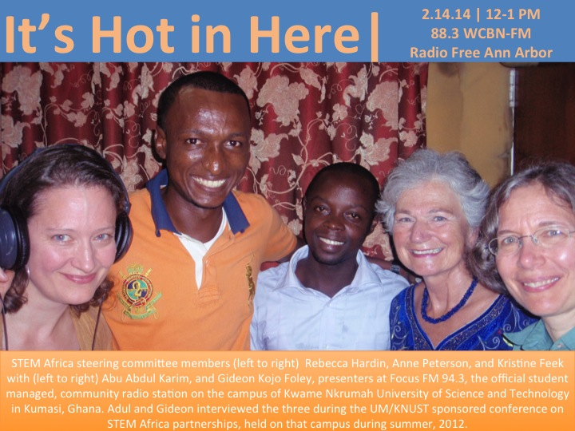

<iframe src="https://archive.org/embed/IHIH321_201403" width="500" height="30" frameborder="0" allowfullscreen="allowfullscreen"></iframe>

This week [Dr. Rebecca Hardin](https://sites.google.com/a/umich.edu/rebecca-hardin/home) takes us on an auditory cruise across continents, academic disciplines, and musical gems like no one else can (NB: we can say that, cause she's our hero).

Inspired by the upcoming April 1-4, 2014  [U-M STEM-Africa Initiative Conference: Effective U.S. Strategies for African STEM Collaborations, Capacity Building, and Diaspora Engagement](http://ii.umich.edu/asc/initiatives/sciencetechnologyengineeringandmathematicsstem/umstemafricainitiativethirdbiennialconference_ci) sponsored by the [UM African Studies Center](https://www.facebook.com/UMAfricanStudies), Rebecca takes us through the complexities and cultural politics of technological change, economic growth, and academic research on the African Continent and in the African Diaspora.

[Dr. Heather Eves](http://www.sais-jhu.edu/heves1) enriches our conversation with insights from her conservation-oriented collaborations across Africa, the US, and Europe.  Dr. Eves has worked for over 15 years to build curriculum and build capacity on management overhunting and the bushmeat trade in Central, Eastern, and Southern Africa, most recently with the [Bushmeat Free Eastern Africa Network.](http://www.bushmeatnetwork.org/)

If that's not enough - we feature creative (and sometimes scathing) musical and lyrical commentary on these same issues in African and African Diasporic poetics - from the orchestral stylings of the Central African Republic, Gil-Scott Heron, and Sun-Ra to the "only MC with and MSC," Naeto C.

It's a show you will not want to miss.

Inspirired to learn more: Register (for free) for the upcoming UM Science, Technology, Engineering and Math conference [here.](http://ii.umich.edu/asc/initiatives/sciencetechnologyengineeringandmathematicsstem/umstemafricainitiativethirdbiennialconference_ci)

|   <iframe src="http://www.youtube.com/embed/PtBy_ppG4hY?wmode=opaque" width="300" height="150" frameborder="0" allowfullscreen="allowfullscreen"></iframe>         |   <iframe src="http://www.youtube.com/embed/3nCKLvkpjWE?wmode=opaque" width="300" height="150" frameborder="0" allowfullscreen="allowfullscreen"></iframe>         |
| --- | --- |
