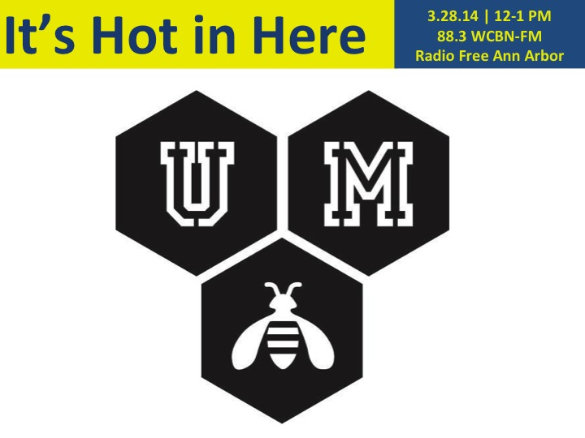

<iframe src="https://archive.org/embed/328ihih" width="500" height="30" frameborder="0" allowfullscreen="allowfullscreen"></iframe>

Honey - it's delicious, nutritious, and one of the most labor-intensive food products known to man. That is, if we give credit where it's due - to bees and those who work to keep them flourishing!

This week: Rich Wieske, maker of meade and pollinator of the City of Detroit with [Green Toe Gardens](http://www.greentoegardens.com/) and Mike Bianco [UM Bees](https://www.facebook.com/UMBees) Minister (one among many!) and bee activist join us in the studio to share their wealth of knowledge and buzzing passion for reversing one of the most disquieting developments of our time - the disappearance of the honey bees. Jim Johnson, Jennifer's uncle and backyard beekeeper, joins in the conversation too, with his account of the sacrifices burgeoning beekeepers must sometimes make to keep their hives happy over the recently brutal winter months.

Listen in and learn what intrepid beekeepers like Rich, Mike, and Jim are doing to cultivate more and better hives of happy bees.

Interested in starting your own hive(s)? Check out a beekeepers association nearest you:

At the University of Michigan: [UM Bees](https://www.facebook.com/UMBees) [The Northern Bee Network](http://northernbeenetwork.com/) [The Southern Michigan Beekeepers Association](http://sembabees.org/) [The Michigan Beekeepers Association](http://www.michiganbees.org/) [The Central Ohio Beekeepers Association](http://www.centralohiobeekeepers.org/)
