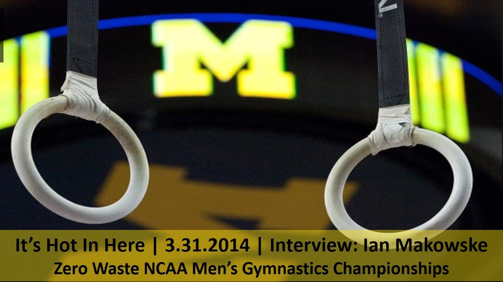

[Ian Makowske](http://www.mgoblue.com/sports/m-gym/mtt/makowske_ian00.html), lifelong competitive gymnast and [SNRE](http://www.snre.umich.edu/) master's student, takes us behind the scenes of the upcoming [NCAA Men's Gymnastics Championships](http://www.mgoblue.com/sports/m-gym/mich-m-gym-body.html). Not only will the University of Michigan be hosting the event for the first time in 40 years, it'll be the first time ever that the [gymnastics championships go "zero waste"](http://www.mgoblue.com/sports/m-gym/spec-rel/040314aaa.html). Ian explains what exactly that means and offers us some insight into the incredible amount of organizing and planning that went into making it happen.<!--more-->

The NCAA Men's Gymnastics Championships will take place at the Crisler Center April 10, 11, and 12. [Tickets](http://ev8.evenue.net/cgi-bin/ncommerce3/SEGetEventList?groupCode=MG&linkID=umichse&shopperContext=&caller=&appCode=&format=grpMenu) can be purchased online or at the door.

If you want to hear more about the fusion of Ian's two passions--environmental sustainability and sports--listen in to our [10.04.2013 Homecoming episode](http://hotinhere.us/1/post/2013/10/10042013-homecoming.html), in which Ian tells us about the reuse-reduce initiative at the Big House football stadium.
