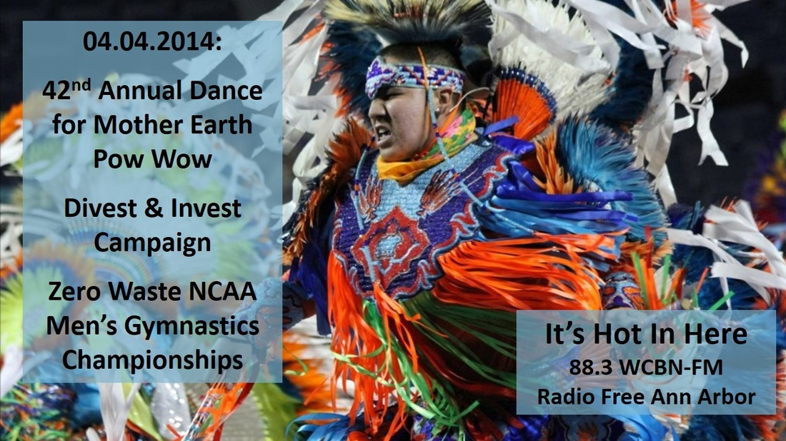

To many Native Americans, the spring and summer months are known as powwow season--celebratory gatherings in which people come together to dance, sing, socialize, and honor Native cultures. Brittany Anstead and Hayden Hedman, two SNRE students and active members of the [Native American Students Association](http://www.umich.edu/~aium/nasa/) at the University of Michigan, helped organize the [42nd Annual Dance for Mother Earth Pow Wow](http://powwow.umich.edu/), taking place April 5th and 6th at Skyline High School. Brittany and Hayden offer up a delightful overview of what the event will entail, including dance contests, a fashion show, and lots of fry bread!<!--more-->

If you've heard about the campaign to end the University of Michigan's investment in the fossil fuel industry and want to learn more about, you'll also want to tune into to the interview in the second half of the show with Laura Hobbs of the [Divest and Invest](http://www.divestum.org/) coalition and Jacob Barde of the new [Law Students for Responsible Divestment from Fossil Fuels](https://www.law.umich.edu/journalsandorgs/Pages/FossilFuelsDivestment.aspx) organization. Laura and Jacob give an overview of how divestment works and what they hope to accomplish through it. U of M affiliates who wish to support their cause can do so by signing the [online Invest and Divest petition](https://csg.umich.edu/upetition/p/divestUM/).
