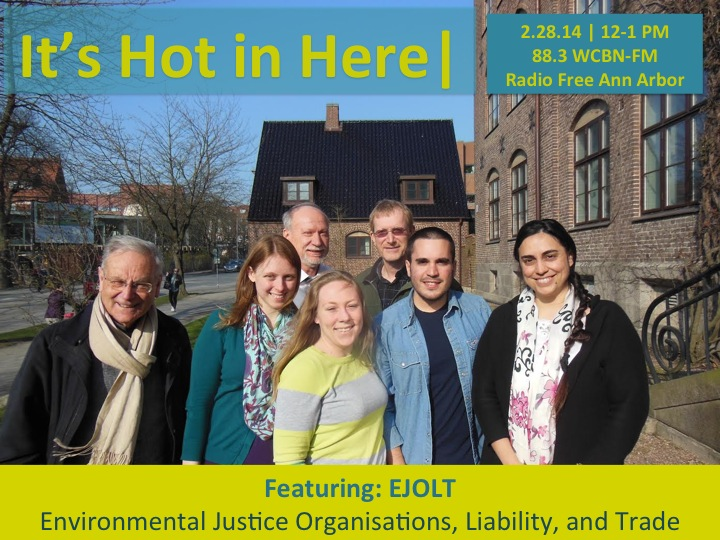

It's not often the US is left off any major world atlas. But such was the case with the European Union-funded [Environmental Justice Organizations, Liabilities and Trade (EJOLT) project](http://ejolt.org/), which has previously reported on and analyzed 1,000 environmental conflicts in more than 60 countries, including India, Ecuador, Turkey, Mexico and South America. This data was organized on an interactive online mapping platform known as the **[EJOLT Atlas](http://ejatlas.org/),** which allows users to search and filter environmental conflicts across 100 fields and to browse by commodity, company, country, and type of conflict. But until now, U.S. case studies had not been included in EJOLT's efforts.<!--more-->

From 2013-2014, SNRE masters students Alejandro Colsa,Bernadette Grafton, Katy Hintzen, and Sara Orvis worked to include US environmental conflicts in the EJOLT Atlas.  Under the guidance of Professors Rebecca Hardin and Paul Mohai, the team surveyed more than 200 geographically diverse environmental justice leaders across the US, and compiled a "Top 40" list for the global atlas.

Alejandro, Bernadette, and Sara sat down with Rebecca on It's Hot In Here to talk about what drew them to the project, their perspective on environmental justice, their methodology during the project (now dubbed the "Michigan Method"), and their hopes for the future of the EJOLT Atlas.

To read more about the SNRE EJOLT Master's Project team, check out Rebecca Hardin's blog post, "[U-M students compile list of top ecological conflicts in US history](http://biotically.blogspot.com/2014/03/u-m-students-compile-list-of-top.html)", or the [Michigan news piece](http://ns.umich.edu/new/releases/22058-u-m-students-compile-list-of-top-ecological-conflicts-in-us-history) about it.
