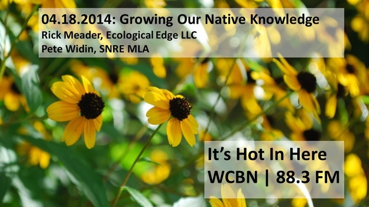

"It doesn’t take much reading about current events to find articles detailing the plight of migratory songbirds and butterflies like monarchs. Due to a variety of circumstances, but especially the loss of suitable feeding and breeding habitat, numbers have dropped significantly and there is no reason to believe that that course will be reversed unless we do something about it.

Fortunately, individual property owners can do something about it. **Using a variety of trees, shrubs and herbaceous plants in your yard will help to provide resting and feeding spots for these critters, even if your yard is small.**_**<!--more-->**_

> **“If you plant it, they will come'** to paraphrase a famous movie’s famous line, and Ecological Edge LLC was created to help you do just that. Whether you have a large expanse of lawn that you can add needed (and beautiful) vegetation to, or just a small courtyard, you’ll be amazed at how birds, bees and butterflies find them, if you install the right plants." - **[Rick Meader, Ecological Edge LLC](http://www.ecologicaledgellc.com/about-ecological-edge-llc/)**

After a long, hard winter, few things are more exciting than peering out of a formerly frosty window to find green buds appearing on branches clear of snow. Spring is here folks, and that means Ann Arbor's gardeners have some busy weeks ahead of them. We celebrate the onset of this joyous season by talking native landscaping with Rick Meader, SNRE alum, licensed landscape architect, and founder of [Ecological Edge LLC](http://www.ecologicaledgellc.com/).

In the second half of the show, [Pete Widin](https://twitter.com/PitaWidn), SNRE MLA student, calls in about his recent petition to the Ross School of Business to reconsider its [decision to transplant a 300-year old bur oak](http://www.mlive.com/news/ann-arbor/index.ssf/2014/04/university_of_michigan_plans_t_6.html) to accommodate its renovation. Pete speaks about the human significance of the legacy tree and our society's increasing "nature deficit disorder". Pete's [petition](https://docs.google.com/a/umich.edu/spreadsheet/ccc?key=0An5fXWYieDYvdDJ4UWR1NV92ZmZsS05KYThMcEQyRHc&usp=sharing) has drawn over 300 signatures from members of the University of Michigan and Ann Arbor community.

To read more about the importance of native plants, make sure to peruse Rick's [Native Plants Blog](http://www.ecologicaledgellc.com/native-plants-blog/) as well as read his beautiful ["My native plant thankful list"](http://www.annarbor.com/home-garden/my-native-plant-thankful-list/) on The Ann Arbor News.
