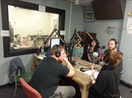

 

*"bitters are to cocktails, like seasonings are to food."*

This week Frank Fejeran (Chef) and Zack Zavisa (Bartender) of [The Ravens Club](http://theravensclub.com/) take us on a savory trip through culinary and liquid media.  Join us!

The journey begins with the delights and (occasional) challenges of sourcing the most local (and happily produced) produce, beef, and cheese, and continues on to the pleasures of creating (and drinking) classic and creative cocktails with small-batch spirits and house-made mixes - think fresh tonic, complex bitters, fermented fruits.<!--more-->

Then, Claire Boland, soon-to-be freshly minted M.S. graduate of the [School of Natural Resources and Environment](http://www.recycleannarbor.org/?module=Home), joins the conversation, giving us the run-down on the "life cycle analysis" of home-brewed beer.

Dania Gutierrez and Christine Chessler-Stull of [Recycle Ann Arbor](http://www.recycleannarbor.org/?module=Home) wrap up our expedition with a run-down on Ann Arbor's upcoming [Earth Day Festival](http://www.lesliesnc.org/a2earthday)!  From live raptors, delicious foods, crafts for the kids, and a recycled fashion show - it's all happening this Sunday, April 27th from 12-4 PM at the Leslie Science Center.  Visit the [City of Ann Arbor's page for more details](http://www.lesliesnc.org/a2earthday)!

Thirsty? Tummy Growling?  Head on over to [The Ravens Club](http://theravensclub.com/) @ 207 South Main Street, Ann Arbor.  Overwhelming odds are - you'll be very glad you did!
