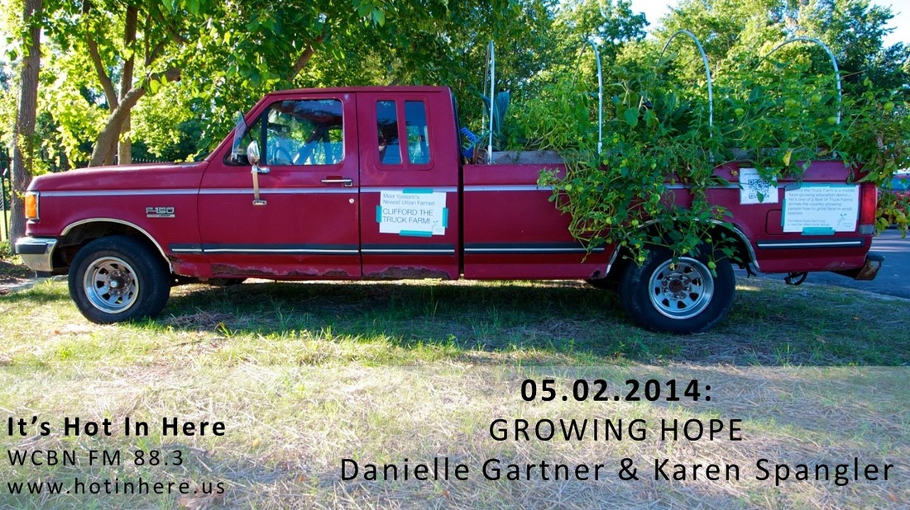

[**Growing Hope**](http://www.growinghope.net/), an Ypsilanti-based nonprofit, helps people improve their lives and communities through gardening and healthy food access.  Using a strengths-based approach, the Growing Hope team works to build peoples' capacity to use community and school gardens as vehicles for positive social, economic, environmental and neighborhood change. They advocate for healthy food, manage an urban farmers’ market, and train youth and adults to make positive investments in their future.

...and they even take the show on the road with [**Clifford, the big red truck farm**](http://www.growinghope.net/clifford_truck_farm_ypsilantis_own_educational_mobile_garden)!<!--more-->

Danielle Gartner, Program Director, and Karen Spangler, Project Coordinator, share the story of how Growing Hope has blossomed from a single school and neighborhood garden site into an incredibly innovative and impactful celebration of the power of community.

After listening in, head on over to [**YpsiPlanti**](https://www.facebook.com/ypsiplanti), Ypsilanti's pop-up garden supply and consulting store, open May and June only. And say hi to the Growing Hope team each week at the [**Ypsilanti**](https://www.facebook.com/YpsilantiFarmersMarkets) and [**Wayne**](https://www.facebook.com/waynefarmersmarket) farmers markets.
