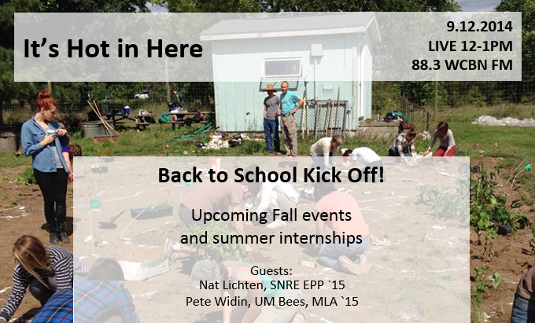

The It's Hot in Here family kicked off the new  season with an introduction to 3 of our new hosts: Becca Baylor, Pearl Zeng, and Dania Gutierrez. We are really excited to welcome our new hosts to the family and are looking forward to what an new year of IHIH will bring.

Flipping the classroom is the theme for the start of the show! We brought in Nat Lichten, School of Natural Resources and Environment's second-year policy student, to discuss with our news hosts their summer internships. Listen in to hear how students at SNRE are connecting with communities at the local, national and global level!<!--more-->

We took a quick call to learn about the proceedings at the [Michigan Environmental Justice Summit](http://www.dwej.org/event/michigan-environmental-justice-summit/) taking place in Lansing. This incredible summit is bringing together organizations across the state to learn about justice issues and how to get active in their community.

Our last guest is Pete Widin from [UM Bees](https://www.facebook.com/UMBees), Landscape Architecture student at the School of Natural Resources and Environment, who calls in to tell us about the new Pollination Sanctuary Garden that will be planted at the Campus Farm at the Matthaei Botanical Gardens. Pete discusses how this garden will benefit wildlife, diversity and native Michigan pollinators that are critical to our food systems. This is a great effort to not only provide pollinator species with forage, but to connect students and the community to local food systems.

We wrap up the show with some advice from Nat and our 3 hosts on how to find a rewarding summer internship that connects what we learn in the classroom with real change!
