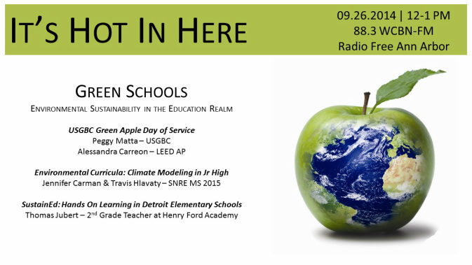

Saturday, September 27th 2014 marks the [US Green Building Council's](http://www.usgbc.org/) third annual [Green Apple Day of Service](http://www.mygreenapple.org/), during which parents, teachers, students, companies and local organizations dedicate their time to transforming schools into healthy, safe and productive learning environments through local service projects. The It's Hot In Here crew decided to join the action as a registered project by dedicating this week's show to the greening of schools--inside and out!<!--more-->

Peggy Matta, Chair of the USGBC's [Detroit Regional Chapter Green Schools Committee](https://www.facebook.com/pages/Green-Schools-Committee-USGBC-Detroit-Regional-Chapter/166864566787175), kicks us off, highlighting the USGBC's work in schools, as well as what the Green Apple Day of Service is all about. Alessandra Carreon, certified LEED AP and a Day of Service project lead, calls in next with a great preview of some of the projects in Detroit this year.

After a Jack Johnson music interlude, Pearl interviews Jennifer Carman and Travis Hlavaty, two [Behavior, Education, and Communication](http://www.snre.umich.edu/degrees/masters/bec/overview) MS students at SNRE about an exciting initiative to teach junior high students about the environment by having them build climate models!

And, finally, Thomas Jubert, a 2nd grade teacher in Detroit's Henry Ford Academy and officer of [SNRE's Sustainability Without Borders](http://www.snre.umich.edu/news/02-03-2014/sustainability_without_borders), talks about [SustainEd](http://css.snre.umich.edu/page/sustainability-without-borders), an interactive after-school program that incorporates project-based learning and field trips to get elementary school students excited about and engaged with Science, Technology, Engineering, Arts, and Mathematics (STEAM).
