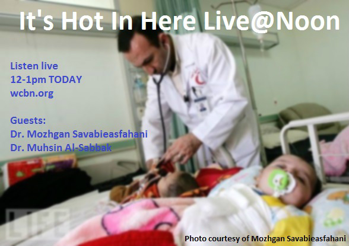
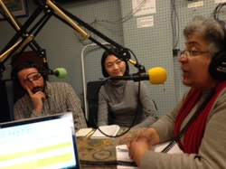

We start off the show with an old feature, “What’s in season?”, and discussions of kale, squash, fresh herbs and even some late-season tomatoes! Sam Molnar, second-year Environmental Informatics and Environmental Justice master’s student at the School of Natural Resources and Environment, joins us for the show and tells us about a vegan squash soup he made recently. Sam lets us in on his recipe (that sounds amazing) so as Rebecca advised us, “squash soup it up, people!”<!--more-->

The remainder of the show features our guest, Dr. Mozhgan Savabieasfahani , an environmental toxicologist and global public health advocate, who discusses the impact of United States military interventions in Iraq on the health of local people. Dr. Savabieasfahani and her colleague, Dr. Muhsin Al-Sabbak, gynecologist at Basra Maternity Hospital in Iraq, recently spoke at the School of Natural Resources and Environment about the epidemic of birth defects in Iraq that may be linked to environmental contamination caused by military activity. While this is a tragic and controversial global issues, She also discusses the importance of having have open discussions of the long-term implications of military activity around the world. Dr. Savabieasfahani provides listeners with hopeful advice to public health researchers and Americans to continue the conversation of the consequences of war.
