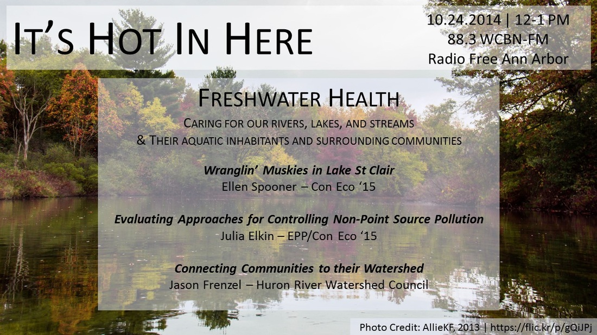
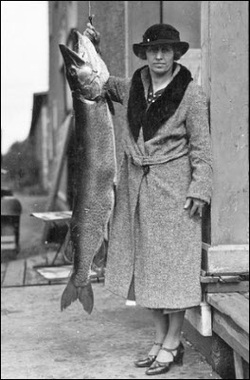

Today's show features extra freshness: two SNRE masters students and the volunteer coordinator of southeast Michigan's oldest environmental organization talk to us about their work researching and caring for Michigan's lakes and rivers.

 

<!--more-->

**Ellen Spooner** (Con-Eco '15) is a MS student in the Aquatics Department at SNRE. This summer (much to the envy of the IHIH team) Ellen spent her days on the water working with the [**Michigan Department of Natural Resources**](http://www.michigan.gov/dnr), as well as hitching boat rides out on Lake St. Clair with charter captains to catch muskies and find out what they've been eating. Let's pause for a moment and reflect on the size of fish that Ellen was reeling in, subduing (with a contraption she built with the DNR), and whose stomach contents she was then removing.

**Julia Elkin** (EPP/Con-Eco '15) joins us at the 30 minute mark and fills us in on the work she and her [**master's project team**](http://www.snre.umich.edu/current_students/masters_projects/evaluation_of_different_approachesmethodologies_for_controlling) have been conducting for the [**Great Lakes Commission**](http://glc.org/). They're looking at the complex issue of non-point source pollution in the [**Maumee Watershed**](http://www.maumeewatershed.org/district/maumeewatershed/). Julia defines NPS pollution for us: _"You know something's getting out into the system, but you can't say specifically where exactly it's coming from and how much is coming from each source."_ Given the recent water crisis in Toledo, Julia's talk on the show is most timely, and she does an excellent job of expertly describing for us the work she and her team are doing as they think about activities across vast tracts of landscapes in order to stop harmful algae blooms in our water systems.

Finally, **Jason Frenzel** of the [**Huron River Watershed Council**](http://www.hrwc.org/) joins us at the 45 minute mark, and talks to us about the ways in which the HRWC educates and engages communities along the Huron with their watershed. The [**HRWC's huge array of programs**](http://www.hrwc.org/our-work/programs/) include their [**River Roundup**](http://www.hrwc.org/volunteer/roundup/), in which volunteers lead residents to stream sites in order to collect samples of bugs and examine how healthy our rivers are. If, after listening, you want in on the fun yourself, check out the HRWC's upcoming ID Day and their [**extensive list of how you can get involved and take action on your own lawn**](http://www.hrwc.org/take-action/).
