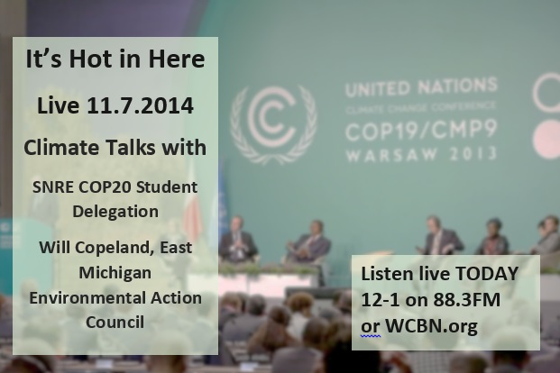

This week on It’s Hot in Here, we discussed the upcoming international climate negotiations at the **United Nations Conference of Parties (COP20) in Lima, Peru**. On the show we had second-year graduate students from the **School of Natural Resources and Environment COP20 student delegation: Katie Browne, Lexi Brewer, Arman Golrokhian, and (from the IHIH family) Pearl Zeng**. Our guests talk about what the COP conferences are all about and how this year’s COP will be different from past years. We learn from fellow students about how they will be involved in COP20 and how they will stay engaged with the U-M community during their time in Peru.<!--more-->

Next, we bring in **Will Copeland of the East Michigan Environmental Action Council** to discuss climate justice with the SNRE student delegation and how COP20 can serve as a platform to bring to light this issue to a greater audience. We break up the conversation with some music from Will Copeland himself! Our guests wrap up the show by envisioning what a climate just world looks like and how we can all be a part of pursuing this vision.

Disclaimer: prepare yourself for lots of acronyms on this show!
