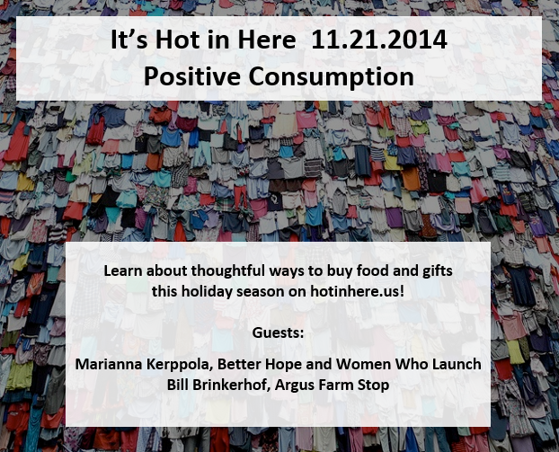

Tune in as we ring in the start of the holiday season by discussing ways that we can make a positive impact in our local community and around the world through the way consume goods. We were having some technically difficulties this time around but this gave us the opportunity to dig through WCBN’s INCREDIBLE archives. What a thrill! <!--more-->

Marianna Kerppola, second-year student at U-M Erb Institute for Global Enterprise, tells about her new online business that connects consumers with clothing made with integrity. [BetterHope](http://betterhope.is/) was created to help others tell a positive story through the items theypurchase for themselves and for others. She discusses the options that are out there for shoppers this holiday season including [ThredUp](http://www.thredup.com/), another online clothing business started by U-M alum. Marianna also tells about another venture of her called [Women Who Launch](http://www.womenwholaunch.org/). This is an effort to connect female entrepreneurs, provide professional development and bridge the gender gap in business. Listen in on Marianna’s interview [**here**](https://ia801004.us.archive.org/28/items/SNREHotInHere/2014-11-21_MariannaKerppola.mp3).

Our second guest is Bill Brinkerhoff, owner of [Argus Farm Stop.](http://www.argusfarmstop.com/) Bill tells about how he was inspired to open up the farm stand this past summer and the importance of creating a sustainable local food ecosystem in Ann Arbor. You can learn more about the Ann Arbor food ecosystem and the Argus Farm Stop [**here**](https://ia601004.us.archive.org/28/items/SNREHotInHere/2014-11-21_BillBrinkerhoff.mp3).
