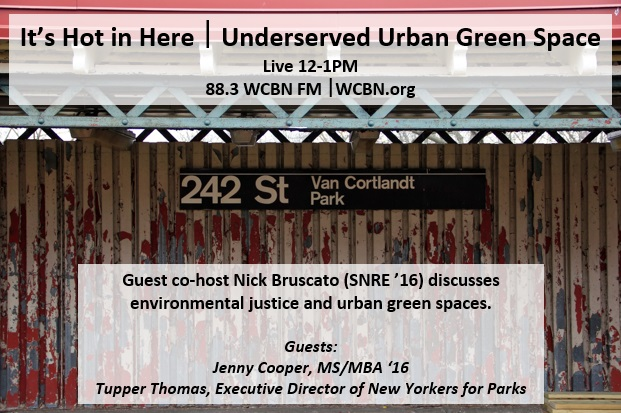
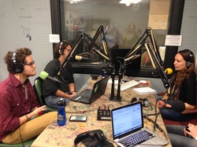

This week our topic and guests came to fruition thanks to our co-host, Nick Bruscato! Nick is a graduate student at the School of Natural Resources and Environment at the University of Michigan and a Participant in the Peace Corps Masters International program. He is studying Environmental Justice with a focus on inequities and access issues of public green space. This past May, Nick graduated from the Joint Program between Columbia University and The Jewish Theological Seminary where he majored in Italian Cultural Studies and Modern Jewish Studies, respectively. Nick loves cooking, kung fu and zoos. His favorite authors include IB Singer, Italo Calvino and Dr. Seuss.<!--more-->

Nick brings to us the lesser known injustices of public green space: the inequities that exist across the globe in the form of funding and access. Jenny Cooper, MS/MBA Candidate at University of Michigan, starts off the conversation by discussing [(Park)ing Day](http://parkingday.org/) in Ann Arbor and the international movement providing more access to recreational space. The conversation continues with [New Yorkers for Parks](http://www.ny4p.org/) Executive Director Tupper Thomas. She talks to us about the state of NYC's parks, troubles with funding and working with different mayoral administrations to better the quality of the city's parks. We then dive into other current issues facing New York Parks and the roots of the inequality.

All this with a backdrop of NYC hip-hop! We would like to thank Nick for putting together an excellent show with some great grooves!
