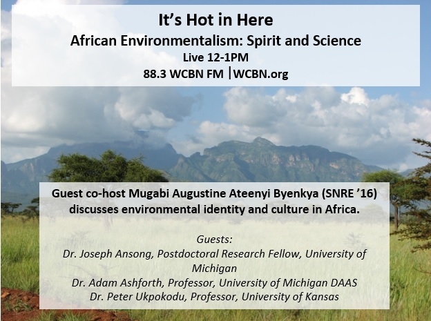
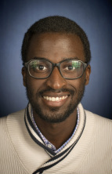

A new student guest co-host brings our final show for the Fall 2014 term this week! Mugabi Augustine Ateenyi Byenkya, a first-year environmental justice master’s student at the School of Natural Resources and Environment. His career interests lie in the intersection between development and environmental injustices issues, generally in the developing world, but more specifically in Sub-Saharan Africa. We start off with an incredible piece of spoken word poetry by Mugabi!

<!--more-->

Mugabi brings to us a new topic for discussion: African environmentalism. What is environmentalism? We discuss the role culture and religion play in developing environmental identities. Mugabi brings in some amazing guests to describe the intricacies of these issues and the potential need for a shift in how we define environmentalism in a changing world:

- Dr. Peter Ukpokodu is a University of Kansas professor and the Chairperson of African and African-American Studies, and a courtesy professor of Theatre and Film.
- Dr. Adam Ashforth is a professor at the Department of Afroamerican and African Studies at the University of Michigan that has published extensively on state formation and the political implications of spiritual insecurity in everyday life in South Africa.
- Dr. Joseph Ansong is a postdoctoral researcher at the Department of Earth & Environmental Sciences at the University of Michigan, currently running and analyzing results from global ocean models to understand the fate of large scale ocean waves.

This entire discussion has all thinking what it means to be an environmentalist in the 21st century and how this impacts the work that we do. We would like to send a huge thanks to Mugabi for putting together an incredible show. What a powerful way to end the term! Thanks for listening world. We’ll be back in January!
