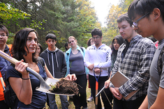

 

*Dr. Marney Isaac, University of Toronto*

It is 2015 and we are back! To kick off the new year on _It's Hot in Here_, our hosts **Rebecca Hardin** and **Sam Molnar** discussed Agroecology with **Dr. Marney Isaac**, Assisant Professor and Canada Research Chair in Agroecosystems & Development at the University of Toronto.

**Bio:** **Dr. Marney Isaac**, Assistant Professor and Canada Research Chair in Agroecosystems & Development, conducts interdisciplinary research on plant strategies and the nutrient economy of agroecological systems while concurrently charting the human dimension of agroecosystem management. Her research provides mechanistic insights into the ecological principles, nutrient cycles, and plant-soil interactions that govern the structure and function of agricultural landscapes, with particular attention on identification of strategies for environmental services, system resilience and sustainable livelihoods. Her research approach makes use of a diverse set of technical tools and employs various temporal and spatial scales: from mechanistic manipulative trials at the rhizosphere scale to large agroecosystem dynamics. She also supervises an international research program investigating agrarian management networks and environmental governance, with an emphasis on understanding innovation in large social-agroecological systems. She has published widely in environmental science, agronomic and multi-disciplinary journals including Agriculture, Ecosystems & Environment, Agronomy for Sustainable Development and Ecology and Society.

Here is her website: [http://blog.utsc.utoronto.ca/misaac/](http://blog.utsc.utoronto.ca/misaac/)

* * *

In addition to agroecology, we followed up with the SNRE MS students after their trip to Peru for the international climate negotiations at the **United** **Nations Conference of Parties (COP20) in Lima, Peru.** The SNRE students that we had on the show included second-year graduate students from the **School of Natural Resources and Environment COP20 student delegation.** We discussed their exciting experiences at one of the most prominent climate talks in the world.

* * *

Our show this week maintained a theme of innovation and taking new approaches to protect the environment and manage land. This segment was a wonderful start to the new year and we are excited for all that 2015 has to offer.
