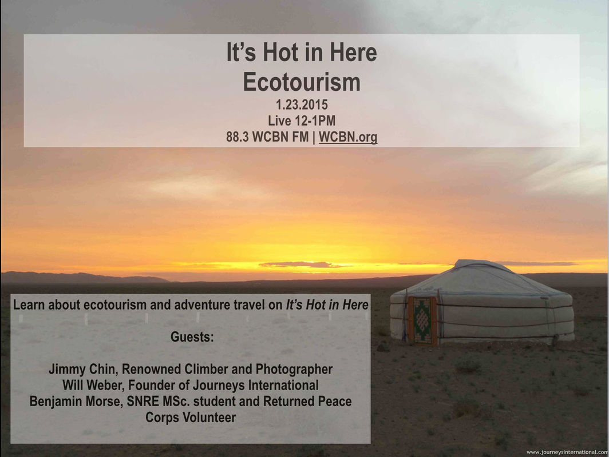
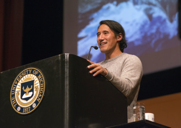
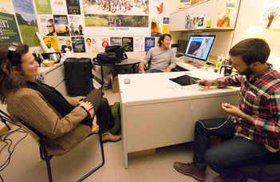
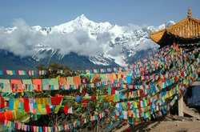

Today's show features **Jimmy Chin**, renowned **North Face** team Climber and Photographer, **Will Weber**, Founder of **Journeys International** and Returned Peace Corps Volunteer, and **Benjamin Morse**, SNRE MSc. student (2016) and Returned Peace Corps Volunteer.

<!--more-->

**Jimmy Chin** is a professional outdoorsman, climber, skier, and photographer. Jimmy has been sponsored by **The North Face** since 2001, and has led many outdoor expeditions in various countries around the world. Jimmy's accomplishments include, but are not limited to climbing Mount Everest, the Karakoram Mountains of Pakistan, and the Himalayas. Jimmy grew up in Minnesota, but fell in love with climbing after a visit to the mountains in the western United States. An alumnus of **Carleton College**, he received a Bachelors of the Arts in Asian Studies. Jimmy has been featured as a climber and photographer in several publications, including **National Geographic**, **Outside Magazine**, and **Men's Journal.** Tune in to hear our interview with Jimmy. **Jimmy's personal website,** [http://www.jimmychin.com](http://www.jimmychin.com)

* * *

**Benjamin Morse** ([babmorse@umich.edu](mailto:babmorse@umich.edu)) is a first year MSc. student (2016) at the **University of Michigan School of Natural Resources and Environment**, and Returned Peace Corps Volunteer. Benjamin's undergraduate degree is in Natural Resource, Recreation and Tourism, and he has done extensive research related to Ecotourism. Benjamin studied "**Sustainable Tourism**" while abroad in Australia, worked at a wildlife refuge in Costa Rica on **Ecotourism Development**, and helped to pioneer a **"Community-based Ecotourism"** initiative while serving in the Peace Corps in Ethiopia. Benjamin is currently looking into **Ecotourism** as an antecedent to environmentally responsible behavior as a thesis at SNRE.

**Will Weber** is the founder of **Journeys International** and Returned Peace Corps Volunteer. Will and his wife, Joan, founded **Journeys International** with a trek to Nepal in 1978. Will has enjoyed travel, natural history and birding in particular since childhood. Will writes: "I like to get comfortably lost in new places and find my way back by asking questions, observing the terrain and listening to environmental rhythms. I graduated from the **University of Wisconsin, Madison**, in 1970 and spent three years as a teacher and environmental specialist in the Peace Corps in Nepal. Later, I returned to the U.S. to recieve my Ph.D. in Natural Resources from the **University of Michigan**. I have been fortunate to visit most of the destinations you find on these pages, whether with my family, solo, or with a **Journeys International** group. Tune in to learn about Will's background as an SNRE student, how his company grew, and his perspective on Ecotourism and sustainability. **Journeys International Site Link,** [http://www.journeysinternational.com](http://www.journeysinternational.com)

* * *

