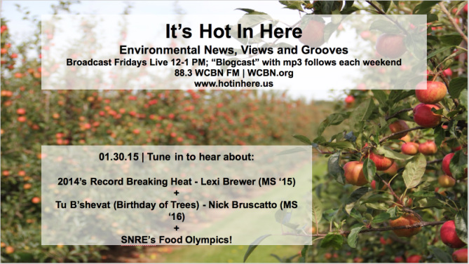
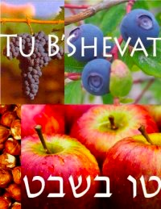
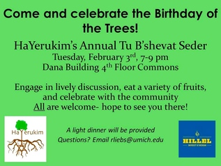
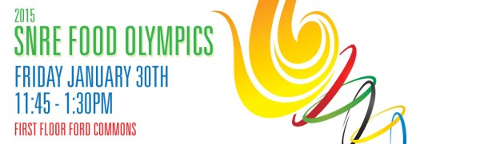
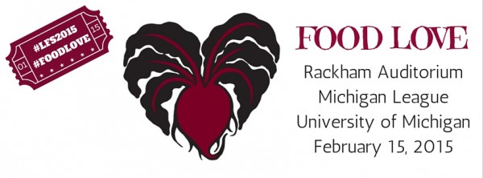

On this week's show, we discussed current environmental news, climate change with **Alexandra (Lexi) Brewer** **(MS '15)**, **Tu B'shevat (Birthday of Trees)** with **Nick Bruscatto (MS '16)**, and the **SNRE Food Olympics** with **Rebecca Baylor**. We also discussed the upcoming and exciting events happening around SNRE and the University of Michigan!

<!--more-->

One of our hosts, **Andrea Kraus**, discussed climate change and 2014's Record Breaking Heat with **Alexandra (Lexi) Brewer (**[abrewe@umich.edu](mailto:abrewe@umich.edu)**)**. **Lexi** is a Master's Student in SNRE, in the Environmental Policy and Planning and Environmental Justice tracks. Within SNRE, **Lexi** is focusing on climate adaptation strategies, and climate justice. **Lexi** did her undergraduate degree at the University of Washington in Seattle, and has a B.S. in Oceanography and a B.A. in Finnish. **Lexi** has worked for UW's Program on Climate Change and Climate Impacts Group, as well as for NOAA.

**Nick Bruscato (**[bruscato@umich.edu](mailto:bruscato@umich.edu)**)** is back and talking about trees in a whole new way! You may remember **Nick** from our segment on **Urban Parks** ([http://www.hotinhere.us/1/post/2014/12/1252014-undeserved-urban-green-space.html](http://www.hotinhere.us/1/post/2014/12/1252014-undeserved-urban-green-space.html))**.** On this week's show, **Nick** joined us to discuss **Tu B'shevat,** the Birthday of Trees. **Tu B'shevat** is the 15th of Shevat on the Jewish calendar -- celebrated this year on Tuesday, February 3, 2015 until sundown on Wednesday, February, 4, 2015 --- is the day that marks the beginning of a "new year" for trees.

**HaYerukim** (Hillel's Environmental Group) will be hosting a **Tu B'shevat** Seder on Tuesday, February 3, 2015, 7:00-9:00 pm at the Dana Building, 4th Floor Commons. Come celebrate the birthday of the trees! Come engage in lively discussion, eat a variety of fruits and veggies, and celebrate with the SNRE and **HaYerukim** community. A light dinner will be served. All are welcome - bring friends! Hope to see you there! **Event link,** [https://www.facebook.com/events/827939170578042/](https://www.facebook.com/events/827939170578042/).

* * *

We capped this week's show with a short segment on the **SNRE Food Olympics** and the upcoming events surrounding food around Ann Arbor. The **SNRE Food Olympics** are a food competition where our awesome and diverse student body represented their country of origin by making a traditional dish and competing to prove what country has the most delicious food!

Stay tuned for next week's show on **Food Love** to celebrate the upcoming **Local Food Summit!** The **Local Food Summit 2015** is taking place on Sunday, February 15, 2015 starting at 8:30am at Rackham Auditorium (Keynote speakers and morning sessions), and the Michigan League (Breakfast, lunch, and afternoon sessions). [Registration is now open](http://www.localfoodsummit.org/) for the 7th Annual Local Food Summit. The theme this year is Food Love with Keynote Speaker Judy Wicks, founder of White Dog Cafe.  To register and learn more about this event, including the tentative agenda, how to submit your food stories for the story slam, and how to nominate your favorite organization for this year's Local Food Victories please visit their website: [http://www.localfoodsummit.org/](http://www.localfoodsummit.org/)

Some other upcoming events at SNRE include a [Free Film Screening - Food Chains: The Revolution in America's Fields](http://snre.umich.edu/events/free_film_screening_food_chains_the_revolution_in_americas_fields) on Thursday, February 05, 2015 in the Blau Auditorium at the Ross School of Business, and [In Memory of Courtney Wilson: Global Issues Symposium on Water Resources](http://snre.umich.edu/events/in_memory_of_courtney_wilson_global_issues_symposium_on_water_resources) on Friday, February 06, 2015 9:00am to 6:00pm in Dana 1040 and Ford Commons. Also, don't miss the **Ann Arbor Folk Festival,** a fundraiser for The Ark, at Hill Auditorium! **Event link,** [http://www.theark.org/shows-events/2015/jan/30/38th-ann-arbor-folk-festival-night-1](http://www.theark.org/shows-events/2015/jan/30/38th-ann-arbor-folk-festival-night-1).
